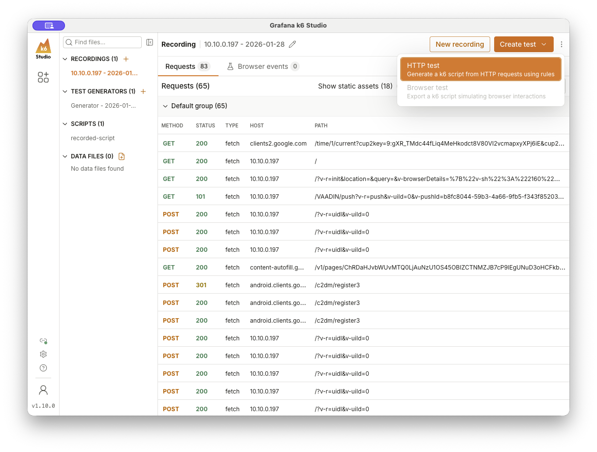
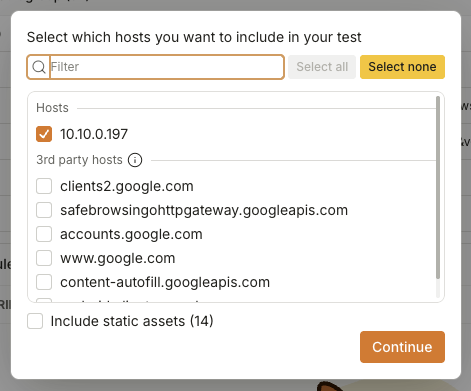
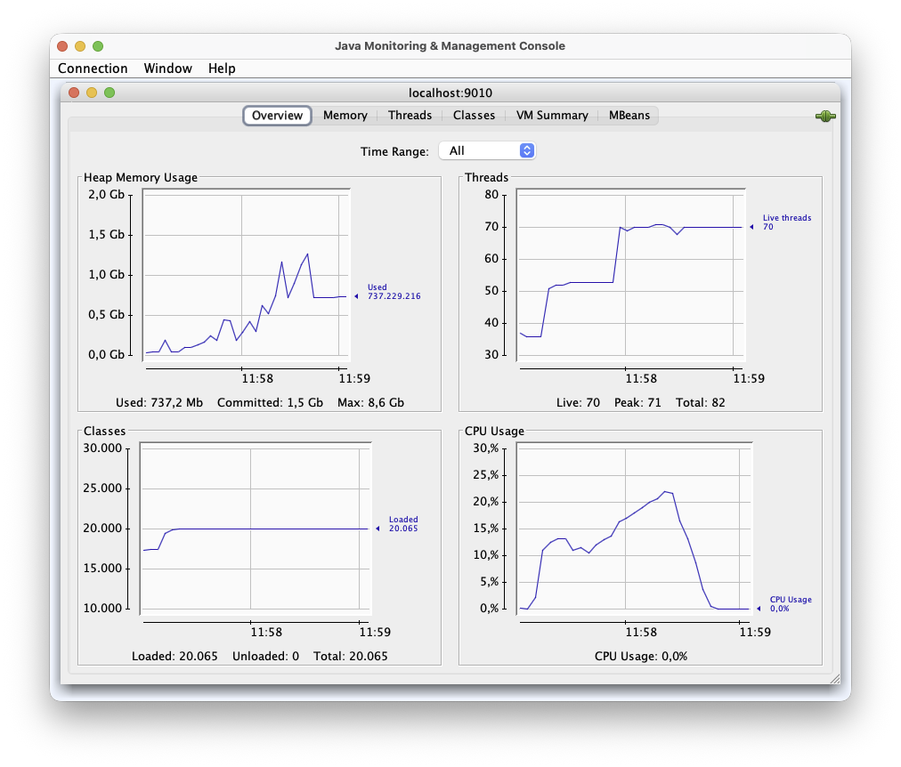

# Load Testing Vaadin Applications with k6

This guide helps you to create load-test for Vaadin applications using Grafana k6 and k6 Studio. The goal is to simulate concurrent user behavior by replaying HTTP requests. The approach is straightforward: record a user journey adn record a request script, extract session-specific IDs to make the script reusable for multiple virtual users and run the test script against your application.

## Sample Application

This repository includes a sample Vaadin application to demonstrate the load test. It's built with Vaadin 25, Spring Boot 4, and uses an H2 in-memory database (uncommented postgresql configuration included).

### Starting the Application

For development (not suitable for load testing):

```bash
./mvnw
```

For production mode (required for load testing):

```bash
./mvnw clean package
java -jar target/k6-example-1.0-SNAPSHOT.jar
```

The application runs at http://localhost:8080.

### Available Views

The application has three views accessible from the side navigation:

| Route | View | Description                                                                                           |
|-------|------|-------------------------------------------------------------------------------------------------------|
| `/` | Hello World | Simple form with a text field and button. Enter a name and click "Say hello" to show a notification.  |
| `/crud-example` | CRUD Example | Master-detail view with a grid of sample persons. Select a row to edit the person in a form.          |
| `/advanced` | Advanced Use Cases | Demonstrates async data fetching, real-time updates via Server Push, and drag-and-drop functionality. |

The **Hello World** view is good for simple load tests. The **CRUD Example** view generates more server-side state and database queries. The **Advanced** view uses Server Push which creates long-lived connections.

## Prerequisites

Before you start, make sure you have:

- A Vaadin application running in **production mode** (use the sample app above or your own)
- [k6 installed](https://grafana.com/docs/k6/latest/set-up/install-k6/)
- [k6 Studio installed](https://github.com/grafana/k6-studio/releases)

## Recording a User Flow

Start k6 Studio and click **Record**. The browser will open with a proxy configured.

Use your machine's IP address instead of `localhost`. This is important because k6 Studio needs to intercept the traffic.

Perform the user journey you want to test. Click through the application as a real user would.

Stop the recording when you're done. Click **Create Test** to generate the script.



Export the script to a `.js` file in folder `k6/tests/`. Name the file after the user flow you're testing.  (e.g. `k6/tests/correlated-script.js`)

Only include requests to your application server. Ignore external requests like Google Fonts or analytics scripts.

Create a copy of the script for backup purposes (e.g. `k6/tests/recorded-script.js`).



## Script Configuration

The k6 script contains a configuration at the top of the file. The requests are grouped into stages and executed in sequentially.

**Before (hardcoded values):**

```javascript
params = {
    headers: {
        Origin: `http://192.168.0.42:8080`,
        Referer: `http://192.168.0.42:8080/`,
    },
    cookies: {},
};

url = http.url`http://192.168.0.42:8080/?v-r=uidl&v-uiId=0`;
resp = http.request(
    "POST",
    url,
    `{"csrfToken":"59b68f0c-b794-4e93-bd91-01d0a472286e","rpc":[...],"syncId":0,"clientId":0}`,
    params,
);

check(resp, {"status equals 200": (r) => r.status === 200});
```

### Base URL

Create a constant at the top of your script for easy environment switching:

```javascript
const BASE_URL = "http://192.168.0.42:8080";
```

Use find/replace to update all hardcoded URLs in the recorded script.


```javascript
let url = http.url`${BASE_URL}/`;
```

Best Practice: Use environment variable (TARGET_IP) to configure the base URL. Take a look into the example file in `k6/tests/examples/example-advanced-correlated-script.js`.

### Values to Extract and Correlate

Vaadin uses session-specific IDs that must be extracted from responses and used in subsequent requests.

#### First Request (to base URL)

The initial GET request downloads frontend resources and returns the `JSESSIONID` cookie.

#### Second Request (to `?v-r=init`)

This initiates the Vaadin session and returns three values:
- `csrfToken` - CSRF protection token
- `pushId` - Push connection identifier
- `uiId` - UI instance identifier

### Helper Functions

This project includes helper functions in [`k6/utils/vaadin-k6-helpers.js`](k6/utils/vaadin-k6-helpers.js):

```javascript
import {
    getJSessionId,
    getVaadinSecurityKey,
    getVaadinPushId,
    getVaadinUiId
} from "../utils/vaadin-k6-helpers.js";  // adjust path based on your script location
```

The file is part of this example project and can be copied into your script folder.

### Extracting Values in the Script

After the first request, extract the session cookie:

```javascript
const jSessionId = getJSessionId(resp);
```

After the second request (`?v-r=init`), extract the Vaadin tokens:

```javascript
const csrfToken = getVaadinSecurityKey(resp.body);
const pushId = getVaadinPushId(resp.body);
const uiId = getVaadinUiId(resp.body);
```

### Using Extracted Values

Set the `JSESSIONID` cookie in params for each request:

```javascript
params = {
    headers: {
        Origin: `${BASE_URL}`,
        Referer: `${BASE_URL}/`,
    },
    cookies: {
        "JSESSIONID": `${jSessionId}`
    },
};
```

Use variables in the URL and payload:

```javascript
url = http.url`${BASE_URL}/?v-r=uidl&v-uiId=${uiId}`;
resp = http.request(
    "POST",
    url,
    `{"csrfToken":"${csrfToken}","rpc":[...],"syncId":0,"clientId":0}`,
    params,
);
```

For push requests, also replace the pushId:

```javascript
url = http.url`${BASE_URL}/VAADIN/push?v-r=push&v-uiId=${uiId}&v-pushId=${pushId}&X-Atmosphere-...`;
```

### After Example

**After (correlated values):**

```javascript
params = {
    headers: {
        Origin: `${BASE_URL}`,
        Referer: `${BASE_URL}/`,
    },
    cookies: {
        "JSESSIONID": `${jSessionId}`
    },
};

url = http.url`${BASE_URL}/?v-r=uidl&v-uiId=${uiId}`;
resp = http.request(
    "POST",
    url,
    `{"csrfToken":"${csrfToken}","rpc":[...],"syncId":0,"clientId":0}`,
    params,
);
```

You find a before after example in [`k6/tests/examples/`](k6/tests/examples/*.js). The before example is in `k6/tests/examples/advanced-correlated-script.js` and the after example is in `k6/tests/examples/advanced-correlated-script.js`.

## Running the Test

### First Test Run

Verify all requests succeed with a single virtual user:

```bash
k6 run k6/tests/examples/correlated-script.js
```

(or whereever your script is located)

### Configure Load Stages

Define user load over time with stages:

```javascript
export const options = {
    stages: [
        { target: 20, duration: "1m" },   // warm up
        { target: 200, duration: "5m" },  // normal load
        { target: 0, duration: "1m" },    // cool down
    ],
};
```

Add more stages for peak scenarios or day/night patterns:

```javascript
stages: [
    { target: 20, duration: "10s" },    // warm-up
    { target: 1000, duration: "2m" },   // ramp to peak
    { target: 1000, duration: "3m" },   // sustain peak
    { target: 100, duration: "2m" },    // back to normal
    { target: 0, duration: "20s" },     // cool-down
],
```

### Thresholds (Optional)

Set performance thresholds for response time and error rate:

```javascript
export const options = {
    thresholds: {
        'http_req_failed': ['rate<0.01'],       // Maximum error rate: 1%
        'http_req_duration': ['p(95)<2000'],    // 95% of requests under 2 seconds
        'http_req_duration': ['avg<800'],       // Average under 800ms
        'checks': ['rate>0.99'],                // Checks must succeed 99% of the time
    },
};
```

See [k6 thresholds documentation](https://grafana.com/docs/k6/latest/using-k6/thresholds/) for more options.

## Monitoring with jconsole

Start the application with JMX enabled to monitor memory and CPU usage:

```bash
mvn clean package -Pproduction && java \
    -Dcom.sun.management.jmxremote \
    -Dcom.sun.management.jmxremote.port=9010 \
    -Dcom.sun.management.jmxremote.local.only=true \
    -Dcom.sun.management.jmxremote.authenticate=false \
    -Dcom.sun.management.jmxremote.ssl=false \
    -jar target/k6-example-1.0-SNAPSHOT.jar &
  jconsole localhost:9010
```

Run the test with an environment variable for the target IP:

```bash
k6 run -e TARGET_IP=<your-local-ip> k6/tests/examples/advanced-correlated-script.js
```

### Calculate Session Size

Use jconsole to measure heap usage before and after the test:



```
Session size per user = (Heap after - Heap before) / Number of users

Example: (2200 MB - 380 MB) / 1000 = 1.8 MB per session
```

## k6 Output Metrics

And here are a example of the metrics k6 outputs:

         /\      Grafana   /‾‾/                                
    /\  /  \     |\  __   /  /                                 
   /  \/    \    | |/ /  /   ‾‾\                                  
  /          \   |   (  |  (‾)  |                                
 / __________ \  |_|\_\  \_____/

     execution: local
        script: k6/tests/examples/advanced-correlated-script.js
        output: -

     scenarios: (100.00%) 1 scenario, 200 max VUs, 3m0s max duration (incl. graceful stop):
              * default: Up to 200 looping VUs for 2m30s over 3 stages (gracefulRampDown: 30s, gracefulStop: 30s)

█ THRESHOLDS
    checks
    ✓ 'rate>0.99' rate=100.00%

    http_req_duration
    ✓ 'p(90)<1000' p(90)=4.55ms

    http_req_failed
    ✓ 'rate<0.01' rate=0.00%

█ TOTAL RESULTS

    checks_total.......: 636776  4213.885124/s
    checks_succeeded...: 100.00% 636776 out of 636776
    checks_failed......: 0.00%   0 out of 636776

    ✓ status equals 200

    HTTP
    http_req_duration..............: avg=1.73ms min=156µs    med=587µs max=385.27ms p(90)=4.55ms p(95)=7.41ms
      { expected_response:true }...: avg=1.73ms min=156µs    med=587µs max=385.27ms p(90)=4.55ms p(95)=7.41ms
    http_req_failed................: 0.00%  0 out of 636776
    http_reqs......................: 636776 4213.885124/s

    EXECUTION
    iteration_duration.............: avg=1.35s  min=536.04ms med=1.36s max=2.72s    p(90)=1.95s  p(95)=2.02s 
    iterations.....................: 11371  75.247949/s
    vus............................: 2      min=2           max=199
    vus_max........................: 200    min=200         max=200

    NETWORK
    data_received..................: 920 MB 6.1 MB/s
    data_sent......................: 441 MB 2.9 MB/s

running (2m31.1s), 000/200 VUs, 11371 complete and 0 interrupted iterations
default ✓ [======================================] 000/200 VUs  2m30s

| Metric | Description |
|--------|-------------|
| `http_req_duration` | Average response time |
| `http_req_failed` | Error rate |
| `http_reqs` | Requests per second |
| `iteration_duration` | Time for one complete iteration |
| `iterations` | Number of completed iterations |
| `data_received` | Total data received |
| `data_sent` | Total data sent |

## Important Notes

- Always run tests against an application in **production mode**. Development mode has extra overhead that skews results.

- **Node IDs in payloads are component-specific.** If you change the application UI, the node IDs will change. You need to re-record the script after UI changes.

- This tutorial does not cover manual node ID handling or troubleshooting memory leaks and CPU issues.

## Example Scripts

This project includes example scripts:

- [`k6/tests/examples/recorded-script.js`](k6/tests/examples/recorded-script.js) - Raw recorded script (before correlation)
- [`k6/tests/examples/correlated-script.js`](k6/tests/examples/correlated-script.js) - Script with extracted session values
- [`k6/tests/examples/advanced-correlated-script.js`](k6/tests/examples/advanced-correlated-script.js) - Full example with thresholds and environment variables
